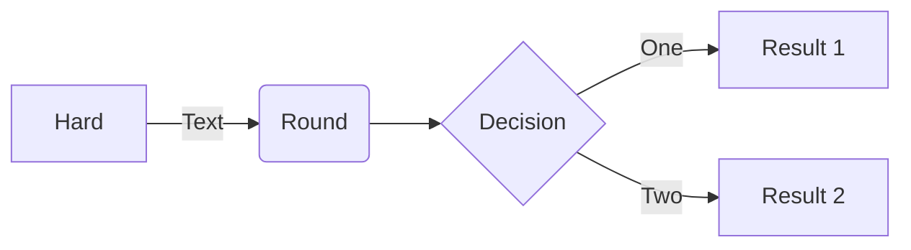

# Cold Office

_Date created: 2026-02-16_

> Quick Access
> - [Home](index.md "Beauchamp")
> - [Publications](Publications.md "Beauchamp:Publications")
> - [Resources](DataSharing.md "Beauchamp:DataSharing")

**Bold** _italic_


This page explains why the office is so cold and how to fix it
press the up button on the thermostat


# Quick Markdown Cheat Sheet

[Here is a more comprehensive cheat sheet](https://github.com/adam-p/markdown-here/wiki/markdown-cheatsheet) if you want more fancy styles/usages.


### 0. Basics

```
**Bold fonts**
_Italic fonts_
~~2 tildes for strikethrough~~
<ins>text underlined</ins>
<!-- for comments -->
```

**Bold fonts**
_Italic fonts_
~~2 tildes for strikethrough~~
<ins>text underlined</ins>
<!-- for comments  -->

You can also use HTML in Markdown

### 1. Headings

Use  hashtag such as `###` at the **beginning** of a line for headings. The number of `#` means the level of header, typically `#` is for Title, `##` is for Sections, ...

### 2. Links

Markdown links can be added via `[text](link)` style. Here is an example:

```
[This is a link to google](https://google.com)
```

[This is a link to google](https://google.com)

You can also cross-reference a document within the project (RECOMMEND using **QuickAdd** add-on feature)
#### Anchor

**Same page anchor links**: [Quick Markdown Cheat Sheet](#quick-markdown-cheat-sheet)

```markdown
[Quick Markdown Cheat Sheet](#quick-markdown-cheat-sheet)
```

#### Footnotes

**Footnote links**: I assume footnotes would be useful in a very technical or long README file. Use square brackets where you want a footnote link to appear and use a caret symbol (^) followed by the number of the footnote.

Then below that add the same syntax followed by a colon and the note itself - none of that will display on the page. That will make the footnote text appear at the bottom of your file:

Footnote.[^1]

Some other important footnote.[^2]

Use this for where you want the link: `[^1]`

Here is the actual footnote syntax:

```markdown
[^1]: This is footnote number one.

[^2]: Here is the second footnote.
```

[^1]: This is footnote number one.

[^2]: Here is the second footnote.
### 3. Lists

```
- item 1
  - sub-item 1
- item 2
1. ordered item 1
	1. ordered subitem a
2. ordered item 2
- [ ] Task 1
- [ ] Task 2

```

- item 1
  - sub-item 1
- item 2
1. ordered item 1
	1. ordered subitem a
2. ordered item 2
- [ ] Task 1
- [ ] Task 2

### 4.  Blockquotes (Callouts)

```
> Quick Tips: ...

> [!NOTE]
> Essential details that users should not overlook, even when browsing quickly.

> [!TIP]
> Additional advice to aid users in achieving better outcomes.

> [!IMPORTANT]
> Vital information required for users to attain success.

> [!WARNING]
> Urgent content that requires immediate user focus due to possible risks.

> [!CAUTION]
> Possible negative outcomes resulting from an action.
```

> Quick Tips: ...

> [!NOTE]
> Essential details that users should not overlook, even when browsing quickly.

> [!TIP]
> Additional advice to aid users in achieving better outcomes.

> [!IMPORTANT]
> Vital information required for users to attain success.

> [!WARNING]
> Urgent content that requires immediate user focus due to possible risks.

> [!CAUTION]
> Possible negative outcomes resulting from an action.

### 5. Tables

Here is a generic table but the Table of Contents above is another version. The pipes create the columns, the colons with dashes create the alignment:

- A colon on the left of the dashes is left-aligned,
- A colon on the right is right-aligned,
- And a colon on both ends is centered

```markdown
| Left aligned Content  | Center aligned Content | Right aligned Content |
| :-------------------- | :--------------------: | --------------------: |
| Content Left          |     Content Center     |         Content Right |
| Content Left          |     Content Center     |         Content Right |
| _Italic_              |        **Bold**        |     ~~Strikethrough~~ |
| <ins>Underlined</ins> |     Content Center     |         Content Right |
```

| Left aligned Content  | Center aligned Content | Right aligned Content |
| :-------------------- | :--------------------: | --------------------: |
| Content Left          |     Content Center     |         Content Right |
| Content Left          |     Content Center     |         Content Right |
| _Italic_              |        **Bold**        |     ~~Strikethrough~~ |
| <ins>Underlined</ins> |     Content Center     |         Content Right |
### 6. Horizontal rules

Use 3 asterisks or 3 dashes with or without a space to create a horizontal rule:

---

```
- - -
---
* * *
***
```

**NOTE**: Make sure to hit <kbd>ENTER</kbd> twice if you intend to use 3 asterisks without spaces or it will set the text above it to an H3 tag. Directly below this paragraph is an HTML `<hr>` tag which looks identical to the HR at the top of this section.

<hr>

HR's look good for visual breaks. You could also use other keyboard symbols like periods:

. . . . . . . . . . . . . . . . . . . . . . . . . . . . . . . . . . . . . . . . . . . . . . . . . . . . . . .
### 7. Code

Use a `single backtick` before and after text to display it as inline code:

```markdown
`single backtick`
```

Here are examples on inline as **`bold`**, _`italic`_, and ~~`strikethrough`~~. There is also a way to show language syntax highlighting (see _Language block_ section below) for inline code, but I think you need to use a package called `highlight.js`.

#### Tab

It took me a while how to show the 3 backticks for a code block (next section). For that and other tricky markdown that will not display, hit the <kbd>TAB</kbd> button twice then enter your code:

    This is a **code** _block_ made by ~~hitting~~ TAB 2 X's

#### Generic code block

To add code that requires more than 1 line then use 3 backticks, hit <kbd>ENTER</kbd>, add your code block, hit <kbd>ENTER</kbd> again and add 3 more back ticks.

````markdown
```
*, *::before, *::after {
  box-sizing: border-box;
}
```
````

You can add language indicator after \`\`\`, such as \`\`\`python
Here is `r`

```r
├── README.md
├── LICENSE
├── CONTRIBUTING.md
├── package.json                # Dependencies and scripts
├── server.js                   # Express server handling API requests
├── .github/
```


### 8. Details

<details>
  <summary>Title 1</summary>
  <p>Some hidden content goes here</p>
</details>
<details>
  <summary>Title 2</summary>
  <p>Same stuff here</p>
</details>

```html
<details>
  <summary>Title 1</summary>
  <p>Some hidden content goes here</p>
  Here is some more without a paragraph tag
</details>
<details>
  <summary>Title 2</summary>
  <p>Same stuff here</p>
</details>
```

### 9. Images & Videos

Images use the same syntax as **Links** except for the addition of an exclamation mark (`!`) immediately before the opening square bracket. You can also use the optional title text. The example image below shows the dimensions but that is just an example. It's up to you to decide the image sizes you want for your files:

<br />


    


### 10. Math

Inline example: this `$(ax^2 + bx + c = 0)$` renders as $(ax^2 + bx + c = 0)$.

Inline exception: use `\$` to escape, and therefore use, a dollar sign in an equation (`$(\$4.00 - \$1.50 = \$2.50)$`): $(\$4.00 - \$1.50 = \$2.50)$

Inline exception 2: use `<span>$</span>` for inline use of dollar sign before a math expression.

Block example: `$$ x = {-b \pm \sqrt{b^2-4ac} \over 2a} $$` renders as:

$$ x = {-b \pm \sqrt{b^2-4ac} \over 2a} $$

Block example 2: This `$$\left( \sum_{k=1}^n a_k b_k \right)^2 \leq \left( \sum_{k=1}^n a_k^2 \right) \left( \sum_{k=1}^n b_k^2 \right)$$` renders as:

$$\left( \sum_{k=1}^n a_k b_k \right)^2 \leq \left( \sum_{k=1}^n a_k^2 \right) \left( \sum_{k=1}^n b_k^2 \right)$$

Here are the important symbols to know:

- `^` = exponent, e.g. $a^3$
- `{ }` = required for certain expressions such as square root
- `\pm` = plus\minus symbol: $\pm$
- `\sqrt` = square root symbol: $\sqrt{b}$
- `\over` = division: $a \over b$
- `\leq` = less than or equal to: $\leq$
- `\geq` = greater than or equal to: $\geq$
- `\ne` = not equal to: $ \ne $
- `\sum` = Sigma, summation symbol: $\sum$
- `\val` = sub-script value: $a_i$
- `\{val=num}^n` = start val and max (n) val for sum
- `\Omega` and `\omega` = greek Omega or omega
- `\int` = interval
- `\bmod` and `\pmod` = modular operators
- `\frac` = fractions
- `\binom` = binomial coefficient
#### Examples for Greek letters

Greek letters are commonly used in mathematics, and they are very easy to type in math mode. You just have to type the name of the letter after a backslash: if the first letter is lowercase, you will get a lowercase Greek letter, if the first letter is uppercase (and only the first letter), then you will get an uppercase letter. Note that some uppercase Greek letters look like Latin ones.

Use `\alpha, \Alpha, \beta, \Beta, \gamma, \Gamma, \pi, \Pi, \phi, \varphi, \mu, \Phi, \Omega, \omega` for $\alpha \beta \gamma \Gamma \pi \Pi \phi \varphi \mu \Phi \Omega \omega \Theta \theta$, etc.

#### Examples for Operators

An operator is a function that is written as a word: e.g. trigonometric functions (sin, cos, tan), logarithms and exponentials (log, exp), limits (lim), as well as trace and determinant (tr, det).

Use `\lim\limits_{x \to \infty} \exp(-x) = 0` for $\lim\limits_{x \to \infty} \exp(-x) = 0$

#### Examples of Powers and indices

Powers and indices are equivalent to superscripts and subscripts in normal text mode. The caret character (`^`) is used to raise something, and the underscore (`_`) is for lowering. For example, use `k_{n+1} = n^2 + k_n^2 - k_{n-1}` for $k_{n+1} = n^2 + k_n^2 - k_{n-1}$.

For powers with more than one digit, surround the power with `{ }`: use `n^{22}` for $n^{22}$.

An underscore (`_`) can be used with a vertical bar (`{\displaystyle |}|`) to denote evaluation using subscript notation: use `f(n) = n^5 + 4n^2 + 2 |_{n=17}` for $f(n) = n^5 + 4n^2 + 2 |_{n=17}$.

#### Examples of Fractions and Binomials

A fraction is created using the `\frac{numerator}{denominator}` command. Use `\frac{n!}{k!(n-k)!} = \binom{n}{k}` for $$\frac{n!}{k!(n-k)!} = \binom{n}{k}$$

You can embed fractions within fractions using `\frac{\frac{1}{x}+\frac{1}{y}}{y-z}`:

$$\frac{\frac{1}{x}+\frac{1}{y}}{y-z}$$

The `\tfrac` and `\dfrac` commands force the use of the respective styles, `\textstyle` and `\displaystyle`. Similarly, the `\tbinom` and `\dbinom` commands typeset the binomial coefficient.

For relatively simple fractions, especially within the text, it may be more aesthetically pleasing to use powers and indices instead: `^3/_7` for $^3/_7$

If you use them throughout the document, usage of `xfrac` package is recommended. This package provides `\sfrac` command to create slanted fractions. If fractions are used as an exponent, curly braces have to be used around the `\sfrac` command.

Color example: try `k = {\color{red}x} \mathbin{\color{blue}-} 2` for $k = {\color{red}x} \mathbin{\color{blue}-} 2$

### 11. Mermaid Diagrams

This is a new markdown element I just became aware of. Check out [Mermaid on GitHub](https://github.com/mermaid-js/mermaid#readme) for more information or go to their [docs page](https://mermaid.js.org/intro/). But it's basically a language code block that renders various diagrams with very specific syntax. And the diagrams have buttons for, zoom in/out, position change, and pop-out box. Check this out:

      graph TD;
      A-->B;
      A-->C;
      B-->D;
      C-->D;


Or this

flowchart LR

    A[Hard] -->|Text| B(Round)
    B --> C{Decision}
    C -->|One| D[Result 1]
    C -->|Two| E[Result 2]



