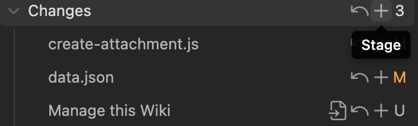

# Use Obsidian to Manage this Wiki

> [!TIP] Quick Access
> - [Home](index.md "Beauchamp")
> - [Publications](Publications.md "Beauchamp:Publications")
> - [Resources](DataSharing.md "Beauchamp:DataSharing")

_Date created: 2026-02-15_

## 1. Install `Obsidian`

_This section allows you to load this wiki locally_

- Download `Obsidian` from https://obsidian.md
- Drag & drop the `Obsidian.app` to your `/Application` folder
- Open `/Application` folder, open Obsidian.app
	- You will be prompted with question to create, open, or sync a vault, choose "Open existing vault", then navigate to the Dropbox -> BeauchamplLabAtPenn -> LabWiki. Open and load this wiki
	- If you are prompted with dialogue whether to trust the plugins, choose "Trust" option. 

## 2. Configure Github (one time for advanced users)

_For typical users, it is recommended to login to the MacPro2 server, from which environment has already been configured. You can skip this entire section._

_This section allows you to configure and publish the wiki to Github from the scratch (for advanced users). You must obtain the permissions from the repository Admin to obtain access._

### Step 2.1: Configure Github SSH Key

Open `Terminal.app` on Mac, type in bash command

```bash
ls ~/.ssh
```

This command lists the files that configure your SSH. If you see `id_ed25519` and `id_ed25519.pub`, then skip the next step.

If the files `id_ed25519` and `id_ed25519.pub` are missing, run the following command

```bash
ssh-keygen -t ed25519 -C "<your_email_for_github>@<email service.com>"
```

This will generate a public/private ed25519 key pair under the `~/.ssh` folder for your Github push & pull.

You will be prompted with the following questions:

```
Enter file in which to save the key (~/.ssh/id_ed25519): 
Enter passphrase (empty for no passphrase): 
Enter same passphrase again: 
```

Just enter nothing and press `return` key to continue.

### Step 2.2 Register your SSH pubkey to Github

Open `~/.ssh/id_ed25519.pub`, if you haven't closed the terminal, type in

```bash
open -e ~/.ssh/id_ed25519.pub
```

Find the line  `ssh-ed25519 XXXXX <your_email@email.com>`, copy it to your clipboard.

Open https://github.com, click on your account on the top-right, click on `Settings`, then [`SSH and GPG keys`](https://github.com/settings/keys), click on [`New SSH Key`](https://github.com/settings/ssh/new), paste the key to the `Key` field, enter a title to document this key (e.g. MyMacBook). Eventually the page should look like this:

```
Title: MyMacBook
Key type: Authentication Key
Key: ssh-ed25519 XXXXX my@gmail.com
```

Click on `Add SSH Key`

### Step 2.3 Configure `git-lfs`

_The repository size is around 2GB, exceeding the limit for a typical Github repository. We use git-lfs to store large files._

Open terminal, cd to the `LabWiki` folder

```bash
# cd /path/to/LabWiki <- IMPORTANT
brew install git-lfs
git lfs install
git pull
```

### Step 2.4 Configure Git on Obsidian

Open Obsidian, use `⌘,`  shortcut, or click from system tray: `Obsidian -> Settings -> community plugins -> Git`, look for "Additional PATH environment paths", paste 

```
/opt/homebrew/bin
```

Then click on the `Reload` button below.

## 3. Create a new wiki page

Open Obsidian, use shortcut `⌘P` (command+P), or click on command-line icon on the left-side of the ribbon, this will allow you to run quick obsidian commands.

To create a new wiki page, open command palette, type in "quickadd". You will see

```
QuickAdd: New BeachampLab Wiki - File Name
```

Click to open the quick-add widget, you will be prompted to enter 

- Topic: the wiki title
- File Name: the filename

This widget automatically saves the new wiki pages to the `pages/Beauchamp/<filename>.md` from a template that is pre-configured for compiling (once you publish the page to Github)

The new page also comes with a handy "Markdown Cheat Sheet" so you can edit the page without referring to extra pages for styling the documents.

## 4. Edit existing page

All the BeauchampLab wiki pages are stored at `pages/Beauchamp/`. You can click to open any page to edit.

The pages are configured to open at reading mode. To edit the file, click on the "Pencil" icon located at the top-right of the opened document, right next to the three dots `...`. 

```
Current view: reading
   Click to read
⌘+click to open to the right
```

The pencil icon will turn into a book-icon once you click on it. Now you should be able to edit the document. Click the book again to turn back into reading mode.

## 5. Insert attachments

The attachments are stored at `attachments/`. Due to some historical reasons, there are lots of attachment folders and it's very hard to manage. I created a widget to insert attachments.

Open Obsidian, use shortcut `⌘P` (command+P), or click on command-line icon on the left-side of the ribbon, this will open command palette.

### 5.1 Insert new attachments

Open command palette, type in "quickadd". You will see

```
QuickAdd: Upload Attachments + Generate Links
```

Click to open the quick-add widget, you will be prompted to choose files to attach. You can attach more than one file.

>You will be asked to select whether this file is going to be saved. To clean up the attachments storage, the new attachments should be saved to one of the following three locations:
>1. `attachments/Shared` for "Large Files": Gtihub has size limitations for each repository. This folder is used to offload some large files so they are not counted towards the quota. However, the update cycle is slow. The files you input to this folder might be reflected on the wiki website in 14 days
>2. `attachments/SmallFiles` for "Small Attachments": This will count towards the Github size quota. Please do not store files larger than 1MB there. I will receive emails from Github to reduce the repository size.
>3. `attachments/Publications` for "Publications": This is a dedicated folder where you save the publication PDFs (will count towards the size quota). 

The new attachments will be saved to `attachments/`, and markdown links to the files are automatically generated. This saves the time and errors in creating the links by yourself.

### 5.2 Insert links to existing attachment

Open command palette, type in "quickadd". You will see

```
QuickAdd: Link To An Existing File
```

Choose this option and you will be asked to select a file to link. You can link to an existing document (wikipage), or an attachment. The markdown links will be created for you.

## 6. Save changes to Github

_If you haven't configured Git ([Section 2](#2-configure-github-one-time-for-advanced-users)), please log on to the MacPro2 to operate_

On the left-side ribbon, you should see a Git icon. If you have hard time finding it, hover on each icon and you will see "Open Git Source control". Click on that icon, and the Git control panel will be opened to the right.


>[!WARNING] Always wait for Dropbox to finish sync first!

Always click on the "Pull" button before changing. This will make sure your local repository is up-to-date with Github, otherwise you cannot push the changes to Github


Then click on the "+" sign next to "Changes": this "saves/stages" the changes you made to the wikis



Finally, click on "Commit-and-sync" button to push the changes to Github


